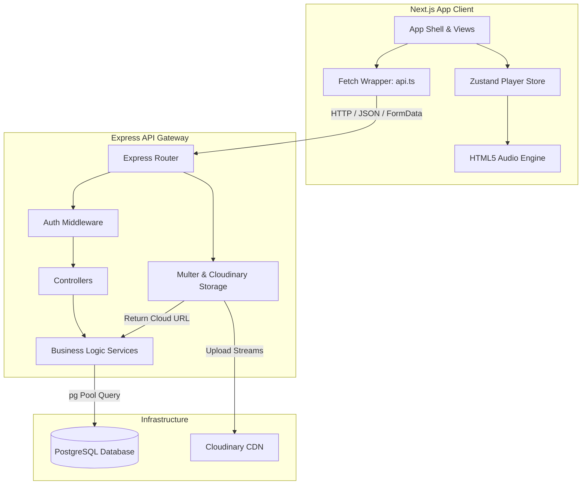
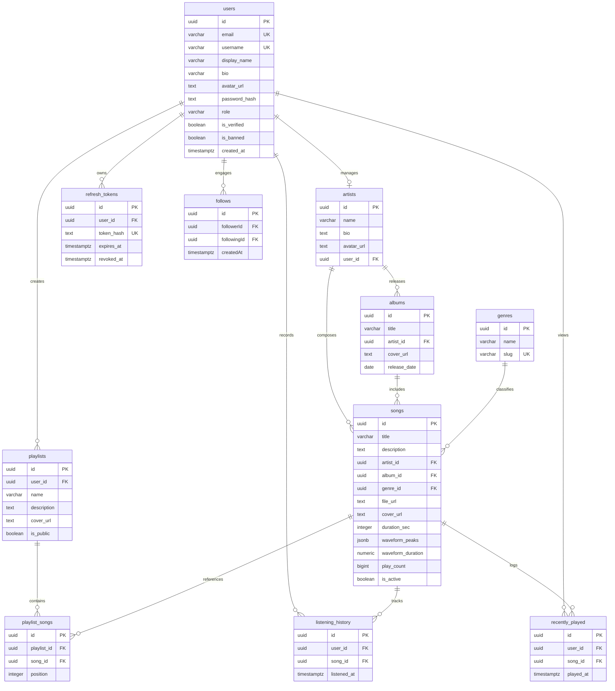

# 🎵 Music Streaming Web App

<div align="center">

A premium, full-stack, responsive music streaming application built as a portfolio showcase.

[](https://nextjs.org/)
[](https://react.dev/)
[](https://www.typescriptlang.org/)
[](https://tailwindcss.com/)
[](https://zustand-demo.pmnd.rs/)

[](https://nodejs.org/)
[](https://expressjs.com/)
[](https://www.postgresql.org/)
[](https://cloudinary.com/)

[Key Features](#-key-features) • [System Architecture](#%EF%B8%8F-system-architecture) • [Database ERD](#%EF%B8%8F-database-erd) • [Setup Guide](#%EF%B8%8F-setup-guide) • [API Directory](#-api-endpoints) • [Manual Test Plan](#-testing-status)

</div>

---

## 🚀 Overview

This **Music Streaming Web App** is a portfolio-ready, full-stack streaming platform featuring a highly responsive, modern user interface alongside a secure, scalable API backend. The system integrates seamless media uploads directly to the cloud, caching of audio waveform data, stateful audio queuing, and a robust role-based admin dashboard.

---

## ✨ Key Features

### 🎧 User Experience & Core Engine

- **Stateful Audio Player**: Implements a Zustand-backed music player supporting continuous playback, queue management, volume controls, progression scrubbing, random shuffle, and various loop states (loop-track, loop-all, loop-off).
- **Direct Cloud Uploads**: High-performance streaming media management. Both cover art and audio files are securely handled in memory and directly uploaded to **Cloudinary** (no local server-side files).
- **Waveform Visualization**: Generates, renders, and caches audio waveform peak data via **WaveSurfer.js** to deliver interactive audio player aesthetics.
- **Dynamic Content Discovery**:
  - **Personalized Feed**: A chronological pipeline displaying new releases specifically from artists the user is following.
  - **Fuzzy Search**: Multi-model backend search suggestions across songs and artists powered by PostgreSQL trigram indexes.
  - **Recent Activity**: Logged-in user activity tracking via deduplicated recently played items and full listening history.

### 🛡️ Platform Security & Session Management

- **Dual-Token Auth**: Secure user session cycles utilizing short-lived JWT Access Tokens and database-stored, bcrypt-hashed Refresh Tokens.
- **Access Control & Permissions**: Strict role-based middleware guarding user profiles, playlists, uploads, and administrative actions.
- **User Ban Control**: Administrative user ban immediately invalidates and purges all active refresh tokens, forcing an immediate session termination.

### 📊 Admin Panel Dashboard

- **System Analytics**: Real-time summary counts of users, tracks, playlists, genres, and aggregate play counts, plus a listing of top songs and newly registered profiles.
- **Administrative Utilities**: Dedicated panel views to manage system users (role elevation, banning), delete public/private playlists, soft-delete tracks (`is_active = false`), and perform administrative metadata curation.

---

## 🗺️ System Architecture

The project maintains a clean separation of concerns, connecting a serverless-ready Next.js application with a standard Node.js API service:



---

## 🗄️ Database ERD

The database runs on PostgreSQL, leveraging relations, cascading foreign keys, and indexes designed to support quick data retrieval:



---

## 📁 Project Structure

```text
.
├── src/                      # Backend Core (Node.js/Express)
│   ├── config/               # DB connections & Cloudinary settings
│   ├── controllers/          # Request routers & response formatters
│   ├── db/                   # Raw SQL schema & migrations
│   ├── middlewares/          # Security, error boundaries, uploads
│   ├── routes/               # Modular Express routing tree
│   ├── services/             # Transaction scopes & database queries
│   ├── utils/                # Base validation & generic helpers
│   ├── app.js                # Main express instance config
│   └── server.js             # Server startup script
│
├── frontend/                 # Frontend Interface (Next.js 16)
│   └── src/
│       ├── app/              # Page router, layout hierarchy
│       │   ├── (main)/       # Main landing, feed, library pages
│       │   └── admin/        # Dashboard & metadata management
│       ├── components/       # Component library (player, layout, admin UI)
│       ├── lib/              # Central API Wrapper client (api.ts)
│       ├── stores/           # Zustand audio player store
│       └── types/            # App-wide TypeScript definitions
```

---

## 🛠️ Setup Guide

### 📋 Prerequisites

- **Runtime**: Node.js v18.x or higher
- **Database**: PostgreSQL v14.x or higher
- **Cloud Accounts**: Cloudinary API credentials

---

### 💻 Local Installation

#### 1. Setup Backend Environment
Clone the repository, enter the root directory, and install backend packages:
```bash
npm install
```

Create a `.env` file in the root directory from `.env.example`:
```env
NODE_ENV=development
PORT=5000

# PostgreSQL Configuration
DB_HOST=localhost
DB_PORT=5432
DB_NAME=music_streaming
DB_USER=postgres
DB_PASSWORD=your_postgres_password
DB_SSL=false

# Session Security Keys
JWT_ACCESS_SECRET=at_least_32_characters_random_string
JWT_ACCESS_EXPIRES_IN=15m
JWT_REFRESH_TOKEN_EXPIRES_DAYS=7

# Cloudinary Credentials
CLOUDINARY_CLOUD_NAME=your_cloudinary_cloud_name
CLOUDINARY_API_KEY=your_cloudinary_api_key
CLOUDINARY_API_SECRET=your_cloudinary_api_secret

# CORS / Origin Settings
FRONTEND_URL=http://localhost:3000
```

#### 2. Configure the Database
Create your local PostgreSQL database, then apply the SQL schema:
```bash
psql -U postgres -d music_streaming -f src/db/schema.sql
```

#### 3. Run Backend Server
```bash
npm run dev
```
The server starts on `http://localhost:5000`.

---

#### 4. Setup Frontend Environment
Navigate to the frontend directory:
```bash
cd frontend
npm install
```

Create a `frontend/.env.local` file:
```env
NEXT_PUBLIC_API_URL=http://localhost:5000/api
```

#### 5. Launch Frontend App
```bash
npm run dev
```
Open `http://localhost:3000` to interact with the application.

---

## 🔌 API Endpoints

All endpoints are prefix-guarded under `/api`.

| Module | Route Endpoint | Authentication | Actions |
|---|---|---|---|
| **Auth** | `/api/auth` | Optional | Register, Login, Refresh, Logout, Me, Edit Profile, Avatar Upload |
| **Songs** | `/api/songs` | Optional | Search, Get by ID, Listen Logger, Save Waveform, Upload Tracks |
| **Playlists**| `/api/playlists` | User Session | CRUD Playlists, Track Addition, Reordering, Track Deletion |
| **Likes** | `/api/likes` | User Session | Like, Unlike, Fetch Liked Songs |
| **Follows** | `/api/follow` | User Session | Toggle Follow, Get Follow Status, List Following |
| **Feed** | `/api/feed` | User Session | Retrieve Chronological Followed Releases |
| **Search** | `/api/search` | Open | Live Unified Search (Artists + Songs) |
| **History** | `/api/history` | User Session | Fetch Listening Log, Clear History |
| **Admin** | `/api/admin` | Admin Session | System Dashboard, Users List, User Role Curation, User Ban/Unban |
| **Metadata** | `/api/artists`, `/api/albums`, `/api/genres` | Mixed | Read (Open) / Write (Admin Only) |

---

## 🧪 Testing Status

Automated end-to-end and unit tests are planned but not fully implemented yet. 

Manual validation is documented in [TEST_PLAN.md](file:///E:/music/TEST_PLAN.md), covering:
- [x] Session Cycles & JWT validation
- [x] Cloud uploads & database integrity checks
- [x] Real-time audio queue manipulation
- [x] Admin console user control tests (banning/role configuration)
- [x] Layout responsive checks across mobile viewports

---

## 🌐 Deployment Overview

- **Backend Node API**: Designed for hosting on Heroku, Railway, Render, or ECS.
- **Frontend App**: Serverless hosting optimized for Vercel or Netlify.
- **PostgreSQL**: Cloud hosting via Supabase, Neon, or RDS.
- **Media Assets**: Distributed and managed globally through Cloudinary CDN.
